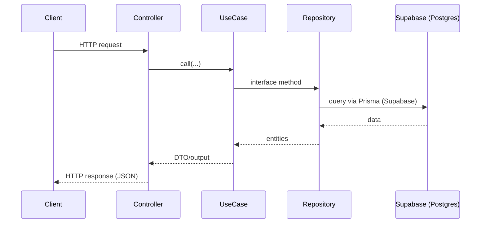
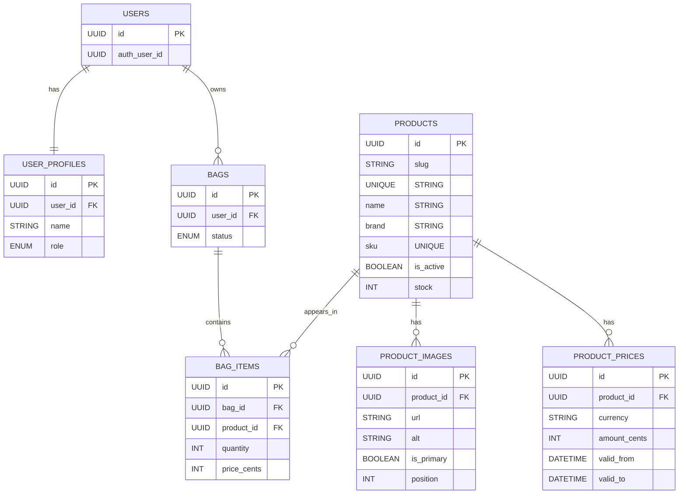

import { Callout } from 'nextra/components'

API construída em NestJS com Prisma.

## Principais pontos

- Estrutura modular por domínio
- Validações e DTOs na apresentação
- Repositórios Prisma na infra

## Estrutura de diretórios (resumo)

```text
apps/api
├── prisma/
│   └── schema.prisma
├── src/
│   ├── application/
│   │   ├── bag|product|user/{interfaces,use-cases}
│   │   └── ...
│   ├── domain/{entities,enums,exceptions,user/value-objects}
│   ├── infra/
│   │   ├── prisma/{prisma.module.ts,prisma.service.ts}
│   │   ├── bag|product|user/repositories
│   │   └── user/{adapters,config}
│   ├── modules/{auth.module.ts,bag.module.ts,orders.module.ts,product.module.ts}
│   ├── presentation/{controllers,decorators,dto,guards,mappers}
│   ├── app.module.ts
│   └── main.ts
└── vercel.json
```

### Árvore completa (atual)

```text
.
├── api
│   └── index.ts
├── .env
├── eslint.config.js
├── .eslintrc.cjs
├── nest-cli.json
├── nodemon.json
├── package.json
├── prisma
│   └── schema.prisma
├── src
│   ├── application
│   │   ├── bag
│   │   │   ├── interfaces
│   │   │   │   ├── bag-item.repository.ts
│   │   │   │   └── bag.repository.ts
│   │   │   └── use-cases
│   │   │       ├── add-item-to-bag.use-case.ts
│   │   │       ├── clear-bag.use-case.ts
│   │   │       ├── convert-bag.use-case.ts
│   │   │       ├── get-bag.use-case.ts
│   │   │       ├── remove-item-from-bag.use-case.ts
│   │   │       └── update-item-quantity.use-case.ts
│   │   ├── product
│   │   │   ├── interfaces
│   │   │   │   ├── product-image.repository.ts
│   │   │   │   ├── product-price.repository.ts
│   │   │   │   └── product.repository.ts
│   │   │   └── use-cases
│   │   │       ├── create-product.use-case.ts
│   │   │       ├── delete-product.use-case.ts
│   │   │       ├── get-product.use-case.ts
│   │   │       ├── list-products.use-case.ts
│   │   │       ├── toggle-product-status.use-case.ts
│   │   │       └── update-product.use-case.ts
│   │   └── user
│   │       ├── interfaces
│   │       │   ├── token.interface.ts
│   │       │   └── user-sync.repository.ts
│   │       └── use-cases
│   │           ├── authenticate-user.use-case.ts
│   │           ├── check-user-permission.use-case.ts
│   │           ├── get-current-user.use-case.ts
│   │           ├── get-current-user-with-public-data.use-case.ts
│   │           ├── login-user.use-case.ts
│   │           ├── logout-user.use-case.ts
│   │           ├── refresh-token.use-case.ts
│   │           ├── register-user.use-case.ts
│   │           └── update-last-sign-in.use-case.ts
│   ├── app.module.ts
│   ├── domain
│   │   ├── entities
│   │   │   ├── bag.entity.ts
│   │   │   ├── bag-item.entity.ts
│   │   │   ├── product.entity.ts
│   │   │   ├── product-image.entity.ts
│   │   │   ├── product-price.entity.ts
│   │   │   ├── public-user.entity.ts
│   │   │   └── user.entity.ts
│   │   ├── enums
│   │   ├── exceptions
│   │   │   ├── bag-exceptions.ts
│   │   │   ├── generic-exceptions.ts
│   │   │   ├── product-exceptions.ts
│   │   │   └── user-exceptions.ts
│   │   └── user
│   │       └── value-objects
│   │           ├── email.vo.ts
│   │           └── role.vo.ts
│   ├── infra
│   │   ├── bag
│   │   │   └── repositories
│   │   │       ├── prisma-bag-item.repository.ts
│   │   │       └── prisma-bag.repository.ts
│   │   ├── prisma
│   │   │   ├── prisma.module.ts
│   │   │   └── prisma.service.ts
│   │   ├── product
│   │   │   └── repositories
│   │   │       ├── prisma-product-image.repository.ts
│   │   │       ├── prisma-product-price.repository.ts
│   │   │       └── prisma-product.repository.ts
│   │   └── user
│   │       ├── adapters
│   │       │   ├── supabase.adapter.ts
│   │       │   └── token.adapter.ts
│   │       ├── config
│   │       │   └── supabase.config.ts
│   │       └── repositories
│   │           ├── auth-user.repository.ts
│   │           ├── permission.repository.ts
│   │           ├── user.repository.ts
│   │           └── user-sync.repository.ts
│   ├── main.ts
│   ├── modules
│   │   ├── auth.module.ts
│   │   ├── bag.module.ts
│   │   ├── orders.module.ts
│   │   └── product.module.ts
│   ├── presentation
│   │   ├── controllers
│   │   │   ├── admin
│   │   │   │   ├── admin.controller.ts
│   │   │   │   └── product.controller.ts
│   │   │   ├── app.controller.ts
│   │   │   ├── bag
│   │   │   │   └── bag.controller.ts
│   │   │   ├── public
│   │   │   │   └── catalog.controller.ts
│   │   │   └── user
│   │   │       ├── auth.controller.ts
│   │   │       └── orders.controller.ts
│   │   ├── decorators
│   │   │   ├── current-user.decorator.ts
│   │   │   └── roles.decorator.ts
│   │   ├── dto
│   │   │   ├── admin
│   │   │   │   └── admin-response.dto.ts
│   │   │   ├── bag
│   │   │   │   ├── add-item-to-bag.dto.ts
│   │   │   │   ├── bag-response.dto.ts
│   │   │   │   ├── remove-item-from-bag.dto.ts
│   │   │   │   └── update-item-quantity.dto.ts
│   │   │   ├── product
│   │   │   │   ├── create-product.dto.ts
│   │   │   │   ├── product-response.dto.ts
│   │   │   │   └── update-product.dto.ts
│   │   │   └── user
│   │   │       ├── auth-response.dto.ts
│   │   │       ├── login-user.dto.ts
│   │   │       ├── refresh-token.dto.ts
│   │   │       └── register-user.dto.ts
│   │   ├── guards
│   │   │   ├── auth.guard.ts
│   │   │   └── roles.guard.ts
│   │   └── mappers
│   │       ├── admin.mapper.ts
│   │       ├── bag.mapper.ts
│   │       ├── product-core.mapper.ts
│   │       ├── product-filters.mapper.ts
│   │       ├── product.mapper.ts
│   │       └── user.mapper.ts
│   └── vercel.ts
├── tsconfig.build.json
├── tsconfig.json
└── vercel.json
```

## Organização e módulos

Apesar do Nest adotar o conceito de módulos (ex.: `auth.module.ts`, `bag.module.ts`, `product.module.ts`), a organização deste projeto segue uma separação por camadas:

- `domain`: entidades, exceptions, enums, value-objects
- `application`: interfaces (contratos) e casos de uso
- `infra`: implementações (Prisma, adapters, repositórios)
- `presentation`: controllers, DTOs, guards, mappers

### Diagrama (fluxo de requisição)



## Deploy na Vercel (API NestJS)

Ver seção detalhada na página principal da API.

## Diagrama ER (simplificado)



## Endpoints

Consulte a página dedicada: [Endpoints da API](./api-endpoints)


