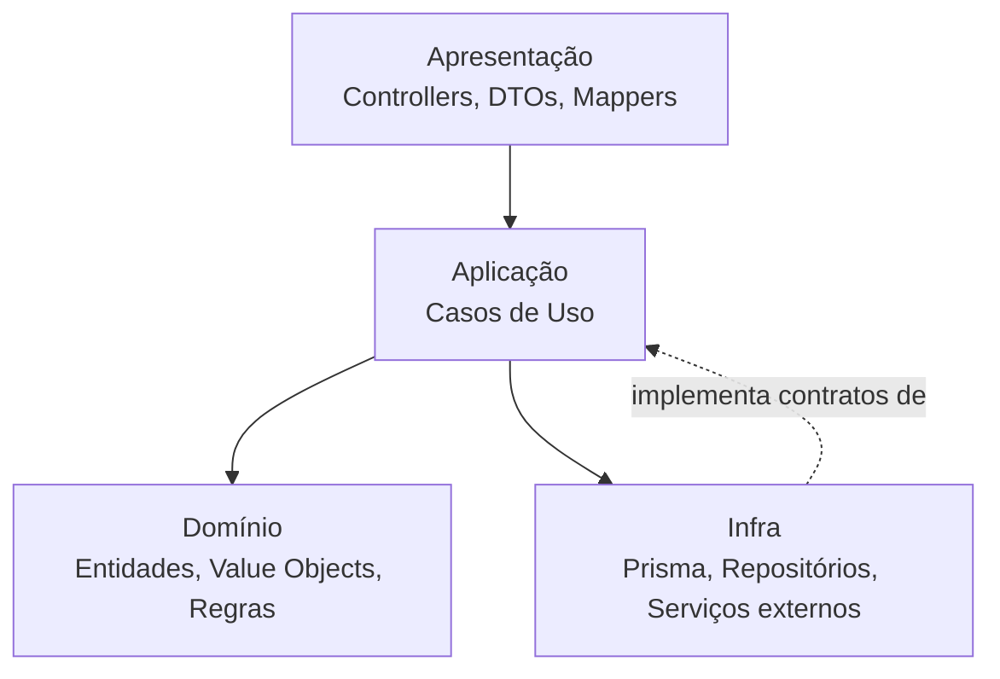

# Arquitetura

Visão geral da arquitetura do monorepo PDPX.

## Monorepo

- Estrutura única (monorepo) para concentrar `API`, `Web` e `Docs`, facilitando reuso, versionamento e DX.
- Workspace com gerenciador de pacotes para compartilhamento de config e tipagens (`packages/`).
- Gerenciado com Turborepo e PNPM workspaces:
  - Scripts na raiz chamam o pipeline do Turbo (`dev`, `build`, `lint`, `test`) conforme `package.json`.
  - `turbo.json` define tasks com dependências entre apps, cache habilitado por tarefa (dev sem cache), e `globalEnv` compartilhado (ex.: `DATABASE_URL`, `NEXT_PUBLIC_SITE_URL`).
  - PNPM workspaces em `pnpm-workspace.yaml` com globs `apps/*` e `packages/*` e `onlyBuiltDependencies` para lidar com binários nativos (ex.: `sharp`, `prisma`, `cypress`).
  - Exemplo útil: `pnpm e2e:open` foca nos testes Cypress do pacote `@pdpx/web-e2e`.

## Camadas

- Domínio e aplicação (casos de uso)
- Infra (Prisma, repositórios)
- Apresentação (controllers, DTOs, mappers)

### Diagrama (camadas)

## Decisões

- NestJS para modularidade e testabilidade
- Prisma para produtividade e tipagem
- Next.js para UX e performance

### Observação sobre NestJS

Utilizamos NestJS neste teste por exigência do desafio. Dependendo do contexto, outras opções podem oferecer menor overhead e/ou maior controle na camada HTTP (rotas e middlewares), por exemplo:

- Fastify — foco em alta performance e baixo overhead; pode ser usado isoladamente ou como adapter do Nest.
- Koa — design moderno com middlewares compostáveis via async/await.
- Hapi — forte foco em configuração e modularidade.

Referências úteis:

- [Fastify (site oficial)](https://fastify.dev/)
- [Visão geral de frameworks Node.js (Trybe Blog)](https://blog.betrybe.com/framework-de-programacao/frameworks-nodejs/?utm_source=openai)
- [Alternativas ao NestJS (G2)](https://www.g2.com/pt/products/nestjs/competitors/alternatives?utm_source=openai)

## API (princípios SOLID)

- Single Responsibility: casos de uso e controllers com responsabilidades claras.
- Open/Closed: repositórios e portas/Adapters favorecem extensão sem modificar o núcleo.
- Liskov Substitution: interfaces de repositório asseguram substituição transparente.
- Interface Segregation: contratos específicos por contexto (ex.: produtos, carrinho, usuário).
- Dependency Inversion: casos de uso dependem de abstrações (interfaces), não de implementações.

## Front-end (SSR e UX)

- Next.js com App Router; uso de Server-Side Rendering (SSR) nas páginas onde faz sentido (ex.: catálogo/SEO) e rendering no cliente quando há forte interação.
- Componentização e acessibilidade; Tailwind para agilidade; React Query para estados assíncronos.

## Banco de dados e Auth

- Banco de dados: Supabase (Postgres) — utilizado como data store principal.
- Integração com Supabase para autenticação/usuário via adapters (`infra/user/adapters/supabase.adapter.ts`).
- Variáveis: `SUPABASE_URL`, `SUPABASE_ANON_KEY`, `SUPABASE_SERVICE_ROLE_KEY` (detalhadas em “Como executar”).

## Qualidade e Testes

- Testes de integração end-to-end com Cypress (`apps/web-e2e/`).

## Documentação

- Documentação dedicada (Nextra) para guiar a avaliação do teste e explicar decisões e estrutura.

